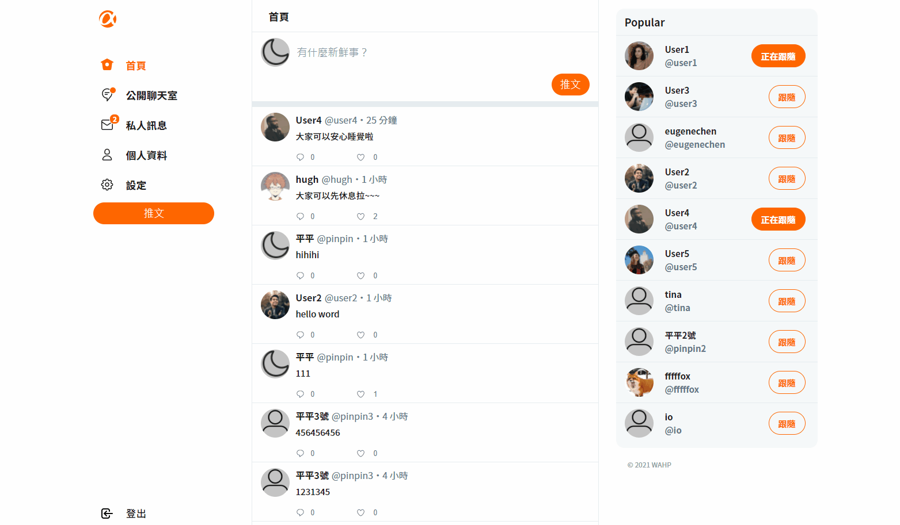

# simple-twitter-frontend

前後分離 simple-twitter-frontend

[前台登入](https://williamtsou818.github.io/simple-twitter-frontend/#/user/login)
[後台登入](https://williamtsou818.github.io/simple-twitter-frontend/#/user/login)
[後端專案](https://github.com/WilliamTsou818/twitter-api-2020)


21/09/26 新增即時聊天功能



## 專案介紹

Aphitter (Simple Twitter) 是一個功能類似於 Twitter 的社群網站，使用者可以進行帳號註冊、登入、編輯個人頁面、發推文、按讚、留言、追蹤其他用戶等等操作。而管理員能夠登入後台，瀏覽所有用戶與推文，並擁有刪除推文的權限。

21/09/26 新增即時聊天功能

使用者可以分別進入公開聊天室與所有用戶進行聊天或是透過個人資料頁面的私訊按鈕向指定用戶發送私人訊息。當收到訊息時側邊攔會顯示未讀訊息提醒使用者。

## 功能介紹

- 使用者可以進行帳號註冊、登入、編輯個人頁面
- 使用者可以發推文、按讚、留言、觀看推文、追蹤其他用戶
- 管理員可以瀏覽所有用戶和推文
- 管理員可以刪除推文

21/09/26 新增即時聊天功能

- 使用者可以分別進入公開聊天室與私人訊息查看歷史聊天紀錄
- 使用者可以在公開聊天室裡看到聊天室所有用戶並進行即時聊天
- 使用者可以在指定用戶的個人資訊頁面點選私訊按鈕發起私人聊天

## 測試使用者帳號

- user1、user2、user3、user4、user5
- 12345678

## 開發人員

- WAHP (work at home professions)
- 後端 [WilliamTsou](https://github.com/WilliamTsou818)
- 後端 [Avery](https://github.com/AveryYang)
- 前端 [Hugh](https://github.com/indexhui)
- 前端 [PINPIN](https://github.com/YPINPIN)

## 框架和套件

- Vue
- vue-notification 、day.js、vue-socket.io

### 環境準備

#### clone 此專案

```
git clone https://github.com/WilliamTsou818/simple-twitter-frontend.git
```

#### Install by yarn or npm

```
yarn install
```

```
npm i
```

### Compiles and hot-reloads for development

```
yarn serve
```

```
npm run serve
```

### Customize configuration

See [Configuration Reference](https://cli.vuejs.org/config/).
